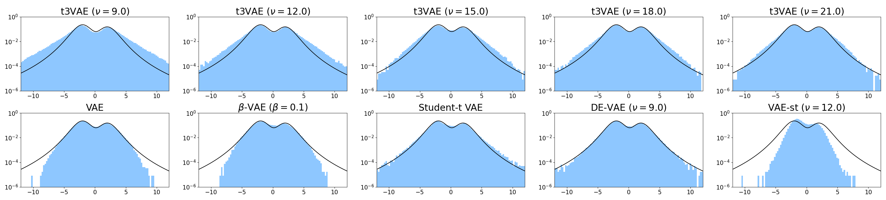
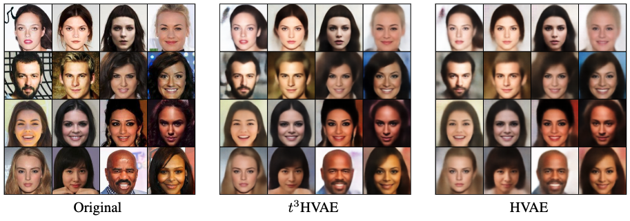

# $t^3$ VAE

Pytorch implementation of $t^3$-Variational Autoencoder: Learning Heavy-tailed Data with Student's t and Power Divergence [[arxiv]](https://arxiv.org/abs/2312.01133)





## Abstract

The variational autoencoder (VAE) typically employs a standard normal prior as a regularizer for the probabilistic latent encoder. However, the Gaussian tail often decays too quickly to effectively accommodate the encoded points, failing to preserve crucial structures hidden in the data. In this paper, we explore the use of heavy-tailed models to combat over-regularization. Drawing upon insights from information geometry, we propose $t^3$VAE, a modified VAE framework that incorporates Student's t-distributions for the prior, encoder, and decoder. This results in a joint model distribution of a power form which we argue can better fit real-world datasets. We derive a new objective by reformulating the evidence lower bound as joint optimization of a KL divergence between two statistical manifolds and replacing with $\gamma$-power divergence, a natural alternative for power families.
$t^3$VAE demonstrates superior generation of low-density regions when trained on heavy-tailed synthetic data. Furthermore, we show that our model excels at capturing rare features through real-data experiments on CelebA and imbalanced CIFAR datasets.

## Contents

In this repository, all experiments from the original paper can be reproduced.

### constants.ipynb

The graph of (1) dependency of regularization on $\Sigma_{\phi}(x)$, (2) the
alternative prior scale $\tau$ against $\nu$, (3) the regularizer coefficient $\alpha$ against $\nu$.

### image_analyses

Experiements on high-dimensional images

### synthetic_data_anlyses 

Experiements on heavy-tailed bimodal distributions

## Requirements

```
pip install -r requirements.txt
```

## Citation

```
@inproceedings{
  kim2024tvariational,
  title={\$t{\textasciicircum}3\$-Variational Autoencoder: Learning Heavy-tailed Data with Student's t and Power Divergence},
  author={Juno Kim and Jaehyuk Kwon and Mincheol Cho and Hyunjong Lee and Joong-Ho Won},
  booktitle={The Twelfth International Conference on Learning Representations},
  year={2024},
}
```
